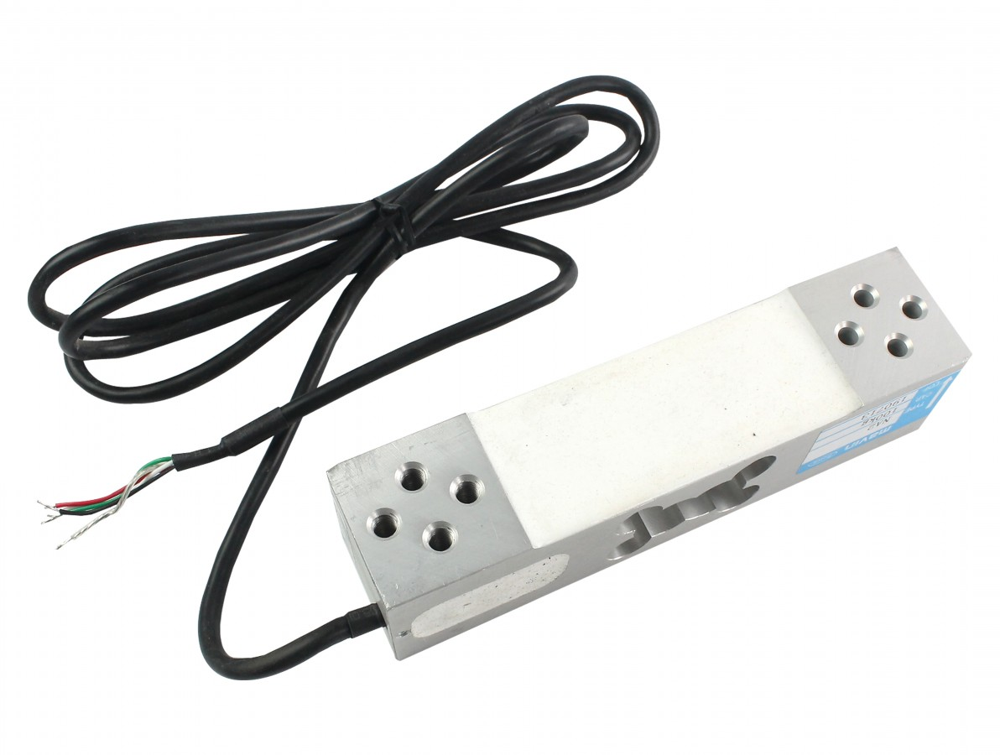
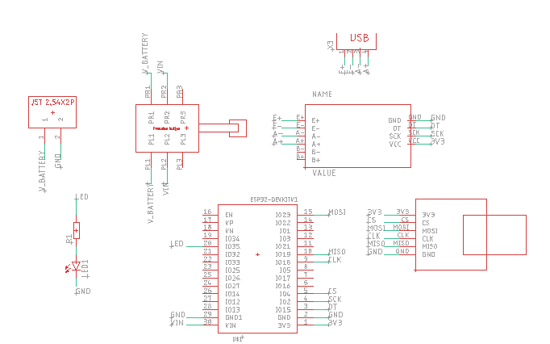
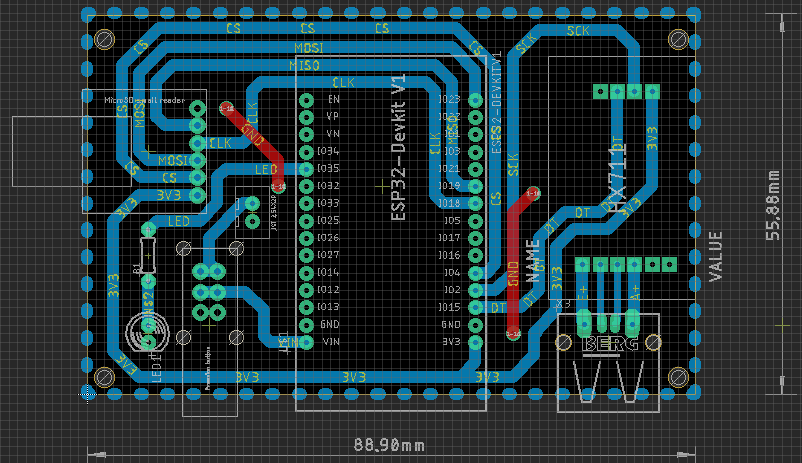
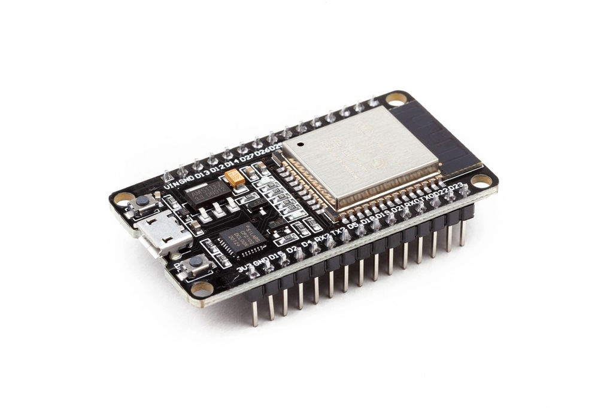

# Placas do Sistema de Leitura do Banco Estático

Este repositório contém os arquivos da **placa principal do sistema de leitura do banco estático**.  
O banco estático é utilizado para medir o **empuxo do motor do foguete durante a queima do propelente**, permitindo a análise do comportamento do motor e do propelente ao longo do tempo de queima.

## Descrição

O sistema eletrônico de leitura do banco estático pode ser dividido nos seguintes componentes:

- **Célula de carga**  
  Responsável por converter a força gerada pelo empuxo do motor em um sinal elétrico proporcional.

- **Placa principal**  
  Responsável por:
  - Realizar a leitura do sinal da célula de carga por meio do módulo **HX711**;
  - Converter os dados brutos em valores compreensíveis pelo microcontrolador **ESP32**;
  - Armazenar os dados de empuxo em um cartão microSD acoplado;
  - Transmitir os dados de empuxo via telemetria utilizando o protocolo **ESP-NOW**.

- **ESP32 remoto**  
  Um segundo microcontrolador ESP32, posicionado a uma distância segura do banco estático, responsável por:
  - Receber os dados de empuxo em tempo real;
  - Permitir o monitoramento remoto durante os testes.

> **OBS.:** Os arquivos da placa podem ser abertos utilizando o software **Autodesk Eagle**.

## Esquemáticos e Layouts

Célula de Carga:

Placa Principal:

ESP32 Remoto:

## Funcionamento

Durante um teste de queima no banco estático, o funcionamento do sistema ocorre da seguinte forma:

1. **Aplicação do empuxo**  
   Quando o motor do foguete é acionado, o empuxo gerado é aplicado diretamente sobre a célula de carga do banco estático.

2. **Leitura da célula de carga**  
   A célula de carga converte a força mecânica em um sinal elétrico de baixa amplitude, proporcional ao empuxo exercido pelo motor.

3. **Amplificação e conversão do sinal**  
   O sinal da célula de carga é enviado ao módulo **HX711**, que realiza a amplificação e a conversão analógica-digital (ADC), fornecendo dados digitais de alta precisão.

4. **Processamento no ESP32**  
   O ESP32 da placa principal:
   - Lê os dados digitais provenientes do HX711;
   - Aplica os fatores de calibração da célula de carga;
   - Converte os valores para unidades físicas de empuxo (por exemplo, Newtons).

5. **Armazenamento dos dados**  
   Os dados de empuxo são armazenados localmente, permitindo posterior análise do desempenho do motor ao longo do tempo de queima.

6. **Telemetria em tempo real**  
   Simultaneamente ao armazenamento, os dados são transmitidos via **ESP-NOW** para um segundo ESP32, localizado a uma distância segura do banco estático.

7. **Recepção remota**  
   O ESP32 remoto recebe os dados em tempo real, possibilitando:
   - Monitoramento contínuo do empuxo durante o teste;
   - Maior segurança para a equipe, evitando proximidade com o motor em funcionamento.

Esse sistema permite uma **aquisição confiável, segura e em tempo real dos dados de empuxo**, sendo essencial para a caracterização e validação de motores foguete em testes de banco estático. O sistema consegue fornecer valores de empuxo a uma taxa de 17hz, ou seja, cerca de 27 amostras em média para uma queima de 1.6s. 
